# CellMem v3 — Techniques Graph

> Last updated: 2026-03-29
> Status: MSA text-prefix injection implemented, 33/33 tests green. Pending GPU validation.

## Graph

```mermaid
flowchart TD
    %% ===== ROOT PROBLEM =====
    ROOT["generation_recall = 0%<br/>Il modello non genera risposte dalla memoria"]
    style ROOT fill:#ff4444,color:#fff,stroke:#cc0000,stroke-width:3px

    %% ===== CAUSE CHAIN =====
    ROOT --> C1["Cross-seq K/V alignment<br/>q_proj frozen non sa fare retrieval cross-sequenza"]
    ROOT --> C2["V-space non codifica risposte<br/>v_proj frozen → features intermedie, non semantiche"]
    ROOT --> C3["Base model ignora contesto<br/>oracle = 65% ceiling"]
    ROOT --> C4["RoPE position mismatch<br/>K memorizzati con pos. diverse dalla query"]
    ROOT --> C5["Residual dilution<br/>ALPHA fisso → contributo diluito dai layer successivi"]

    style C1 fill:#ff8800,color:#fff
    style C2 fill:#ff8800,color:#fff
    style C3 fill:#ff8800,color:#fff
    style C4 fill:#ff8800,color:#fff
    style C5 fill:#ff8800,color:#fff

    %% ===== BUGS RISOLTI =====
    B1["RISOLTO: logit_delta = 0<br/>eval computava no_mem DOPO write_memory"]
    B2["RISOLTO: KV un-normed<br/>hook su layer invece che self_attn"]
    B3["RISOLTO: discrimination_gap<br/>0.072 → 0.802 dopo KVInterceptor fix"]

    style B1 fill:#22aa22,color:#fff
    style B2 fill:#22aa22,color:#fff
    style B3 fill:#22aa22,color:#fff

    B1 -.->|"bug di misurazione"| ROOT
    B2 -.->|"normed vs un-normed"| C1
    B3 -.->|"router funziona"| ROOT

    %% ===== TECNICHE SCARTATE =====
    X1["SCARTATO: ALPHA tuning 0.5/1.0/2.0<br/>Non risolve: q_proj frozen è il vero problema"]
    X2["SCARTATO: Nemotron Cascade 2<br/>Solo 6/52 layer con attention → meno injection points"]
    X3["SCARTATO: Attention Residuals<br/>Depth-wise, non cross-seq. Solo Kimi 48B"]
    X4["SCARTATO: Post-hook KV injection<br/>mem_attn addizionata al residual → garbage dot products"]

    style X1 fill:#888,color:#fff
    style X2 fill:#888,color:#fff
    style X3 fill:#888,color:#fff
    style X4 fill:#888,color:#fff

    X1 -->|"non risolve"| C1
    X2 -->|"peggiora"| C1
    X3 -->|"non risolve"| C1
    X3 -.->|"insight utile"| C5
    X4 -->|"non risolve"| C1
    X4 -->|"non risolve"| C2

    %% ===== OPZIONI VAGLIATE =====
    A["Opzione A: W_Q_cross trainabile<br/>+4M params, query projection dedicata"]
    B["Opzione B: Prefix KV injection<br/>0 params, concatena KV al contesto"]
    Q35["Qwen3.5-4B<br/>partial RoPE 25%, GDN layers"]

    style A fill:#4488cc,color:#fff
    style B fill:#4488cc,color:#fff
    style Q35 fill:#4488cc,color:#fff

    A -->|"risolve parzialmente"| C1
    A -->|"non risolve"| C2
    B -->|"risolve"| C1
    B -->|"crea nuovo problema"| C4
    Q35 -->|"riduce bias 75%"| C4
    Q35 -->|"solo 10/40 layer GQA"| C1

    %% ===== MSA BLUEPRINT (PIANO) =====
    subgraph MSA["MSA Paper — Blueprint validato su Qwen3-4B-Instruct"]
        style MSA fill:#1a5276,color:#fff,stroke:#1a5276
        M1["Testo originale re-injection<br/>+37.1% recall vs solo KV"]
        M2["Parallel RoPE<br/>pos IDs indipendenti per doc memoria"]
        M3["Router W_Q_R + W_K_R<br/>proiezioni dedicate + contrastive loss"]
        M4["Solo ultimi layer<br/>prima metà non ha astrazione semantica"]
        M5["KV compression<br/>mean pooling P=64"]
        M6["Qwen3-4B-Instruct<br/>backbone validato dal paper"]
    end

    style M1 fill:#1e8449,color:#fff
    style M2 fill:#1e8449,color:#fff
    style M3 fill:#1e8449,color:#fff
    style M4 fill:#1e8449,color:#fff
    style M5 fill:#1e8449,color:#fff
    style M6 fill:#1e8449,color:#fff

    M1 -->|"RISOLVE"| C2
    M2 -->|"RISOLVE"| C4
    M3 -->|"RISOLVE"| C1
    M4 -.->|"efficienza"| C5
    M6 -->|"RISOLVE"| C3

    %% ===== RELAZIONI TRA TECNICHE =====
    A -.->|"inclusa in"| M3
    B -.->|"inclusa in + migliorata"| MSA
    Q35 -.->|"alternativa a"| M6

    %% ===== STATO ATTUALE =====
    NOW["STATO ATTUALE<br/>Router: OK recall@4=100%<br/>Injection: FAIL gen_recall=0%<br/>Prossimo: implementare MSA"]
    style NOW fill:#8e44ad,color:#fff,stroke-width:3px

    ROOT --- NOW
```

## Legenda

| Colore | Significato |
|---|---|
| Rosso | Problema root |
| Arancione | Cause identificate |
| Verde scuro | Fix da MSA paper (piano) |
| Verde chiaro | Bug già risolti |
| Blu | Opzioni vagliate (parziali) |
| Grigio | Tecniche scartate |
| Viola | Stato attuale |

## Inventario dettagliato

### Bug risolti

| Bug | Causa | Fix | Impatto |
|---|---|---|---|
| `logit_delta = 0.00` | `eval_generation` computava `logit_no_mem` DOPO `write_memory()` → entrambi con memoria | Computare `logit_no_mem` prima di `write_memory()` (store vuoto → post_hook return early) | Misurazione corretta |
| KV da hidden states un-normed | Hook su `layer.register_forward_hook` → input = residual pre-layernorm | Hook su `self_attn.register_forward_pre_hook` → input = post-layernorm, pre-RoPE | `discrimination_gap` 0.072 → 0.802 |
| FakeLayer test failure | `FakeLayer.forward` non chiamava `self_attn` → pre_hook mai eseguito | `return self.self_attn(x)` | Test passano |

### Tecniche scartate

| Tecnica | Motivo scarto | Insight recuperato |
|---|---|---|
| **ALPHA tuning** (0.5, 1.0, 2.0) | `q_proj` frozen non sa fare cross-seq retrieval; nessun ALPHA risolve questo | Il problema è architetturale, non di iperparametri |
| **Nemotron Cascade 2** (Mamba-2 hybrid) | Solo 6/52 layer con standard attention; SSM layers non accettano K/V injection | Architetture ibride SSM riducono injection points |
| **Attention Residuals** (Moonshot/Kimi) | Opera depth-wise non cross-sequence; solo Kimi 48B come checkpoint | ALPHA fisso è subottimale; peso dovrebbe essere learned e input-dependent |
| **Post-hook K/V injection** | `output += ALPHA * mem_attn` dove `mem_attn = softmax(Q @ K_mem) @ V_mem` con Q/K/V frozen → dot products meaningless | Backbone projections non allineate per cross-seq |
| **Qwen3.5-4B** | Partial RoPE (25%) è utile ma GDN layers (30/40) non accettano K/V; alternativa a Instruct, non complementare | `partial_rotary_factor=0.25` → meno position bias nell'injection |

### Piano MSA (prossimi step)

| Componente | Cosa | Risolve | Fonte |
|---|---|---|---|
| **Testo originale** | Re-iniettare testo doc insieme ai KV | V-space non codifica risposte (+37.1% recall) | MSA paper ablation |
| **Parallel RoPE** | Position IDs indipendenti per ogni doc memoria | RoPE position mismatch | MSA paper Sec. 3 |
| **Router W_Q^R + W_K^R** | Proiezioni dedicate trainabili per routing | Cross-seq alignment | MSA paper Eq. 1-2 |
| **Solo ultimi layer** | Injection nella seconda metà del modello | Efficienza + astrazione semantica | MSA paper + intuizione |
| **KV compression** | Mean pooling kernel P=64 | Scalabilità memoria | MSA paper |
| **Qwen3-4B-Instruct** | Backbone che segue istruzioni | Oracle ceiling 65% → ~90%+ | MSA paper backbone |

## Riferimenti

- MSA paper: [arXiv:2603.23516](https://arxiv.org/abs/2603.23516) — Memory Sparse Attention (Evermind/Shanda)
- Attention Residuals: [arXiv:2603.15031](https://arxiv.org/abs/2603.15031) — Moonshot AI / Kimi
- Nemotron Cascade 2: [NVIDIA Research](https://research.nvidia.com/labs/nemotron/files/Nemotron-Cascade-2.pdf)
- Qwen3.5: [GitHub](https://github.com/QwenLM/Qwen3.5)
