# CellMem v3 — Techniques Graph

> Last updated: 2026-03-29
> Status: HS injection implementata ma degenera in loop. Text prefix = unico approccio funzionante (85%). Tutti gli approcci architetturali testati hanno fallito con backbone frozen.

## Graph

```mermaid
flowchart TD
    %% ===== ROOT PROBLEM =====
    ROOT["generation_recall ARCHITETTURALE = 0%<br/>Nessun approccio di injection dentro l'architettura<br/>funziona con backbone frozen"]
    style ROOT fill:#ff4444,color:#fff,stroke:#cc0000,stroke-width:3px

    %% ===== BASELINE CHE FUNZIONA =====
    BASELINE["TEXT PREFIX INJECTION<br/>generation_recall = 85%<br/>Router selects episodes -> testo nel prompt<br/>FUNZIONA ma è RAG, non architetturale"]
    style BASELINE fill:#22aa22,color:#fff,stroke:#00aa00,stroke-width:3px

    %% ===== CAUSE CHAIN =====
    ROOT --> C1["Cross-seq K/V alignment<br/>q_proj frozen non sa fare retrieval cross-sequenza"]
    ROOT --> C2["V-space non codifica risposte<br/>v_proj frozen -> features intermedie, non semantiche"]
    ROOT --> C6["HS injection degenera<br/>LoRA rank 16 non basta per leggere hidden states iniettati"]

    style C1 fill:#ff8800,color:#fff
    style C2 fill:#ff8800,color:#fff
    style C6 fill:#ff8800,color:#fff

    %% ===== BUGS RISOLTI =====
    B1["RISOLTO: logit_delta = 0<br/>eval computava no_mem DOPO write_memory"]
    B2["RISOLTO: KV un-normed<br/>hook su layer invece che self_attn"]
    B3["RISOLTO: discrimination_gap<br/>0.072 -> 0.802 dopo KVInterceptor fix"]
    B4["RISOLTO: streaming UTF-8<br/>decode token singoli -> chars rotti"]

    style B1 fill:#22aa22,color:#fff
    style B2 fill:#22aa22,color:#fff
    style B3 fill:#22aa22,color:#fff
    style B4 fill:#22aa22,color:#fff

    B1 -.->|"bug di misurazione"| ROOT
    B2 -.->|"normed vs un-normed"| C1
    B3 -.->|"router funziona"| ROOT
    B4 -.->|"cosmetico"| BASELINE

    %% ===== APPROCCI KV INJECTION (FALLITI) =====
    subgraph KV_FAIL["KV Injection — FALLITO (kv_only = 0%)"]
        style KV_FAIL fill:#661111,color:#fff
        KV1["DynamicCache + Parallel RoPE<br/>K/V pre-RoPE -> apply k_norm + RoPE -> DynamicCache"]
        KV2["Memory mask hooks<br/>-inf attention per non-memory layers"]
        KV3["Hybrid text + KV<br/>Testo nel prompt + KV nel cache"]
    end
    KV1 -->|"0% recall"| C1
    KV2 -->|"fix dilution ma 0% recall"| C1
    KV3 -->|"75% (peggio del solo testo 85%)"| C2

    style KV1 fill:#888,color:#fff
    style KV2 fill:#888,color:#fff
    style KV3 fill:#888,color:#fff

    %% ===== APPROCCIO HS INJECTION (PARZIALMENTE FALLITO) =====
    subgraph HS_FAIL["HS Injection — PARZIALE (eval 80%, chat degenera)"]
        style HS_FAIL fill:#884400,color:#fff
        HS1["Hidden state concat pre-layer<br/>Concat [mem_hs; query_hs] prima di ogni decoder layer"]
        HS2["LoRA rank 16 su q_proj<br/>Tutti 36 layer, ~4.5M params"]
        HS3["write_memory_full()<br/>Store TUTTI i token (no surprise filter)"]
        HS4["Prefill + cache generation<br/>Forward con hooks -> KV cache -> remove hooks -> generate"]
        HS5["Training conversazionale<br/>32 conv pairs + 16 facts = 200 samples, 50 epochs"]
    end
    HS1 -->|"logits cambiano"| C1
    HS2 -->|"80% eval recall"| C6
    HS3 -->|"fix details loss"| C2
    HS4 -->|"streaming funziona"| C6
    HS5 -->|"75% recall, ma loop in chat"| C6

    style HS1 fill:#cc8800,color:#fff
    style HS2 fill:#cc8800,color:#fff
    style HS3 fill:#cc8800,color:#fff
    style HS4 fill:#cc8800,color:#fff
    style HS5 fill:#cc8800,color:#fff

    %% ===== TECNICHE SCARTATE =====
    X1["SCARTATO: ALPHA tuning 0.5/1.0/2.0<br/>Non risolve: q_proj frozen e il vero problema"]
    X2["SCARTATO: Nemotron Cascade 2<br/>Solo 6/52 layer con attention"]
    X3["SCARTATO: Attention Residuals<br/>Depth-wise, non cross-seq. Solo Kimi 48B"]
    X4["SCARTATO: Post-hook KV injection<br/>mem_attn addizionata al residual -> garbage"]

    style X1 fill:#888,color:#fff
    style X2 fill:#888,color:#fff
    style X3 fill:#888,color:#fff
    style X4 fill:#888,color:#fff

    X1 -->|"non risolve"| C1
    X2 -->|"peggiora"| C1
    X3 -->|"non risolve"| C1
    X4 -->|"non risolve"| C1

    %% ===== PAPER DI RIFERIMENTO =====
    subgraph PAPERS["Paper studiati"]
        style PAPERS fill:#1a5276,color:#fff
        P_MSA["MSA (arXiv:2603.23516)<br/>Memory Sparse Attention<br/>Text re-injection +37.1% recall<br/>Parallel RoPE, solo ultimi layer"]
        P_MLLM["MemoryLLM (ICML 2024)<br/>github.com/wangyu-ustc/MemoryLLM<br/>HS injection + full fine-tuning<br/>8xA100 x 3 giorni su C4"]
        P_NIMH["NIMH/Scripps 2025<br/>BTSP anti-Hebbian plasticity<br/>Surprise-gated writes"]
        P_INFINI["Infini-attention (arXiv:2404.07143)<br/>Munkhdalai et al. 2024<br/>Delta update rule"]
        P_ATTN["Attention Residuals (arXiv:2603.15031)<br/>Moonshot/Kimi<br/>Depth-wise residuals"]
    end

    style P_MSA fill:#1e8449,color:#fff
    style P_MLLM fill:#1e8449,color:#fff
    style P_NIMH fill:#1e8449,color:#fff
    style P_INFINI fill:#1e8449,color:#fff
    style P_ATTN fill:#1e8449,color:#fff

    P_MSA -->|"blueprint per text prefix"| BASELINE
    P_MSA -->|"KV injection richiede training pesante"| KV_FAIL
    P_MLLM -->|"ispirazione HS injection"| HS_FAIL
    P_MLLM -->|"serve full fine-tuning (7 giorni A100)"| C6
    P_NIMH -->|"surprise writes"| HS3
    P_INFINI -->|"delta update"| KV1

    %% ===== LEZIONE CHIAVE =====
    LESSON["LEZIONE: backbone frozen<br/>non puo leggere memoria iniettata<br/>nell'architettura senza fine-tuning pesante"]
    style LESSON fill:#8e44ad,color:#fff,stroke-width:3px

    C1 --> LESSON
    C2 --> LESSON
    C6 --> LESSON

    %% ===== STATO ATTUALE =====
    NOW["STATO ATTUALE<br/>Router: OK (recall@4=100%)<br/>Text prefix: OK (85%)<br/>KV injection: FAIL (0%)<br/>HS injection: PARZIALE (80% eval, loop in chat)<br/>Chat demo: NON FUNZIONA architetturalmente"]
    style NOW fill:#8e44ad,color:#fff,stroke-width:3px

    ROOT --- NOW
    BASELINE --- NOW
```

## Legenda

| Colore | Significato |
|---|---|
| Rosso | Problema root |
| Arancione | Cause identificate |
| Verde scuro | Paper di riferimento |
| Verde chiaro | Bug risolti / Baseline funzionante |
| Arancione scuro | HS injection (parziale) |
| Grigio | Tecniche/approcci scartati |
| Viola | Stato attuale + lezione chiave |

## Cronologia approcci

| # | Approccio | Recall | Esito | Causa fallimento |
|---|---|---|---|---|
| 1 | KV injection (DynamicCache + Parallel RoPE) | kv_only=0% | FALLITO | q_proj frozen ignora K/V esterni |
| 2 | Hybrid text + KV injection | 75% | PEGGIORATO (vs 85% solo testo) | exp(0)=1 dilution nei layer senza memoria |
| 3 | Memory mask hooks (-inf per non-mem layers) | hybrid=85% | UGUALE al solo testo | KV injection non contribuisce nulla |
| 4 | HS injection (concat hidden states) senza LoRA | 60% | PARZIALE | Backbone non sa leggere HS iniettati |
| 5 | HS injection + LoRA rank 16 (surprise filter) | 25% | FALLITO | Surprise filter perde dettagli |
| 6 | HS injection + LoRA rank 16 (tutti token) | 80% eval | PARZIALE | Eval OK ma chat degenera in loop |
| 7 | HS injection + LoRA conv training (200 samples) | 75% eval | FALLITO in chat | Loop, garbage, repetizioni in chat reale |
| **baseline** | **Text prefix injection (RAG-style)** | **85%** | **FUNZIONA** | **Non e architetturale** |

## Inventario dettagliato

### Bug risolti

| Bug | Causa | Fix | Impatto |
|---|---|---|---|
| `logit_delta = 0.00` | eval computava `logit_no_mem` DOPO `write_memory()` | Computare prima di write | Misurazione corretta |
| KV da hidden states un-normed | Hook su `layer` invece che `self_attn` | Hook su `self_attn.register_forward_pre_hook` | `discrimination_gap` 0.072 -> 0.802 |
| FakeLayer test failure | `FakeLayer.forward` non chiamava `self_attn` | `return self.self_attn(x)` | Test passano |
| attention_mask duplicate kwarg | `**inputs` gia contiene attention_mask | Usare `input_ids=inputs["input_ids"]` | Generate non crasha |
| cache_position empty | HF generate() con synthetic past_key_values | Passare `cache_position` esplicitamente | Generate non crasha |
| Non-memory layer zeros dilute attention | exp(0)=1 nel softmax | `_install_memory_mask_hooks()` con -inf | hybrid = baseline |
| Bool vs float attention mask | `torch.finfo()` su bool dtype | Check `mask.dtype == torch.bool` | Mask hooks funzionano |
| LoRA dtype mismatch | Model bf16, LoRA float32 | `.to(device, dtype)` | LoRA non crasha |
| RoPE shape mismatch HS injection | position_embeddings pre-computate per seq originale | Recompute `cos, sin` nel pre-hook | HS injection funziona |
| HS hooks + autoregressive | Memoria aggiunta ad ogni step di generation | Skip quando `hs.shape[1] <= 1` | Generazione corretta |
| Post-hook strips KV cache | Rimuovere memory tokens dal KV cache durante generation | Manual prefill approach | Streaming funziona |
| Surprise filter perde dettagli | Solo token sorprendenti memorizzati | `write_memory_full()` per tutti i token | 25% -> 80% recall |
| Streaming UTF-8 rotto | Decode singolo token = chars parziali | Decode sequenza intera + diff | Emoji corrette |
| Primo token perso in streaming | Token da prefill non aggiunto a generated_ids | Aggiungere first_id prima del loop | "Ciao" completo |

### Tecniche scartate

| Tecnica | Motivo scarto | Insight recuperato |
|---|---|---|
| **ALPHA tuning** (0.5, 1.0, 2.0) | `q_proj` frozen non sa fare cross-seq retrieval | Problema architetturale, non di iperparametri |
| **Nemotron Cascade 2** | Solo 6/52 layer con attention; SSM non accetta KV | Architetture ibride riducono injection points |
| **Attention Residuals** | Depth-wise non cross-seq; solo Kimi 48B | ALPHA dovrebbe essere learned e input-dependent |
| **Post-hook K/V injection** | Q/K/V frozen -> dot products meaningless | Backbone projections non allineate per cross-seq |
| **Qwen3.5-4B** | Partial RoPE utile ma GDN layers non accettano KV | `partial_rotary_factor=0.25` riduce position bias |
| **KV injection senza LoRA** | kv_only = 0% | Backbone frozen ignora completamente K/V esterni |
| **KV injection con memory masks** | Uguale al solo testo | KV non contribuisce nulla anche senza dilution |
| **HS injection + surprise filter** | 25% recall, perde dettagli | Bisogna memorizzare TUTTI i token |
| **HS injection + LoRA small training** | 80% eval ma loop in chat | LoRA overfitta su pattern specifici, non generalizza |

## Riferimenti

- **MSA**: [arXiv:2603.23516](https://arxiv.org/abs/2603.23516) — Memory Sparse Attention (Evermind/Shanda/Peking U). Text re-injection +37.1%, Parallel RoPE, router W_Q^R/W_K^R. Backbone: Qwen3-4B-Instruct-2507.
- **MemoryLLM**: [ICML 2024](https://github.com/wangyu-ustc/MemoryLLM) — Hidden state injection per-layer, full fine-tuning 8xA100 x 3 giorni su C4. Ispirazione per HS injection approach.
- **Attention Residuals**: [arXiv:2603.15031](https://arxiv.org/abs/2603.15031) — Moonshot AI / Kimi. Depth-wise residuals.
- **Nemotron Cascade 2**: [NVIDIA Research](https://research.nvidia.com/labs/nemotron/files/Nemotron-Cascade-2.pdf) — Mamba-2 hybrid.
- **Qwen3.5**: [GitHub](https://github.com/QwenLM/Qwen3.5) — Partial RoPE, GDN layers.
- **NIMH/Scripps 2025** (Bhatt et al.): BTSP anti-Hebbian plasticity, surprise-gated writes.
- **Infini-attention**: [arXiv:2404.07143](https://arxiv.org/abs/2404.07143) — Munkhdalai et al. 2024. Delta update rule.
- **LeWorldModel**: [arXiv:2603.19312](https://arxiv.org/abs/2603.19312) — SIGReg principle, direct auxiliary loss.
- **Video Reasoning**: [arXiv:2603.16870](https://arxiv.org/abs/2603.16870) — Reasoning in middle-to-upper layers.
